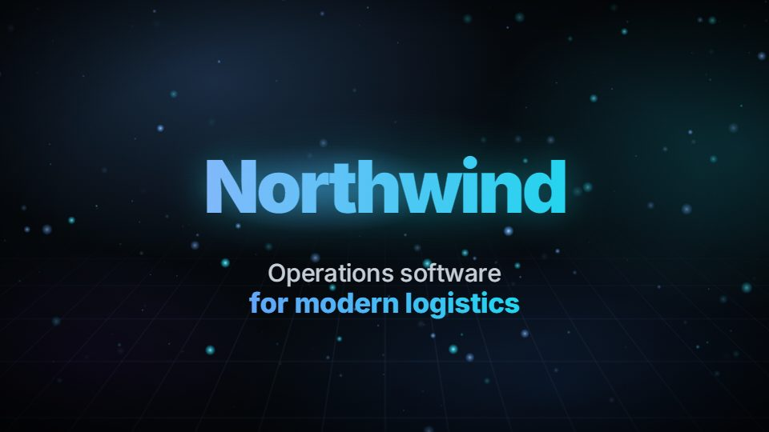
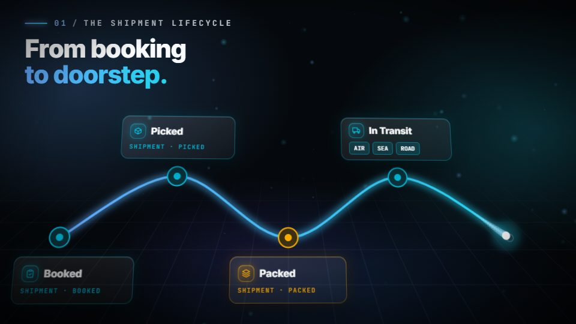
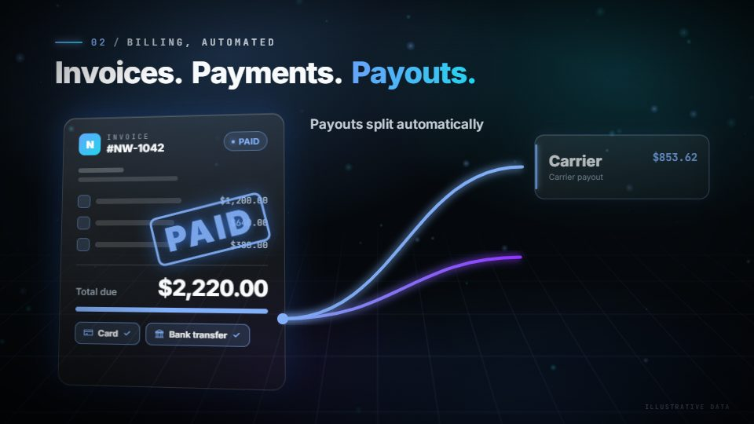
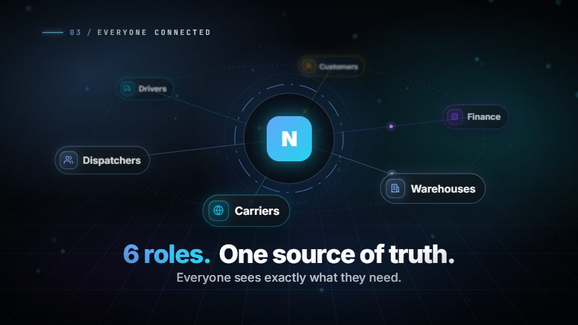
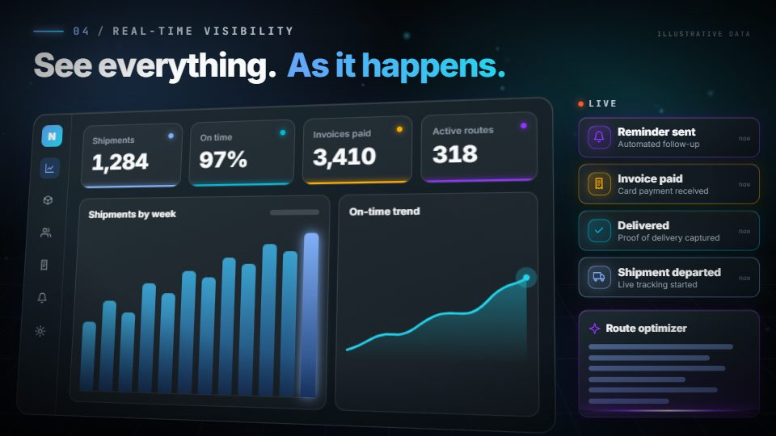
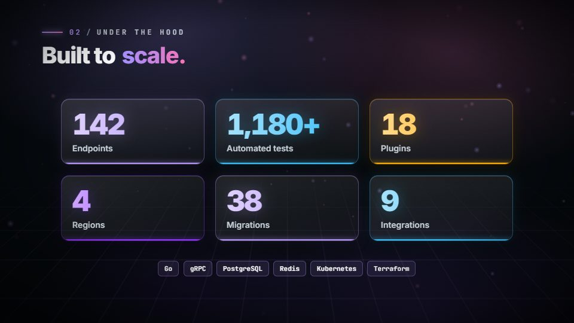

<div align="center">

# 🏠 Skillroom

### Claude Agent Skills that do real work.

*A small, curated room of skills: each one is focused, tested and documented.*

[](https://skills.sh/vivekparmar-18/skillroom)
[](LICENSE)
[](https://github.com/vercel-labs/skills)
[](CONTRIBUTING.md)

```bash
npx skills add VivekParmar-18/skillroom
```

</div>

---

## 🗂️ Skills in this room

| Skill | What it does | Install |
|---|---|---|
| 🧠 [**prompt-intelligence-engine**](skills/prompt-intelligence-engine) | Turns one-line prompts into expert-level prompts: intent detection, auto expert role, surfaced assumptions, quality score. | `npx skills add VivekParmar-18/skillroom --skill prompt-intelligence-engine` |
| 🎬 [**repo-reel**](skills/repo-reel) | Turns any codebase into a cinematic 1080p60 motion-graphics product video with sound, built from the real facts in your repo. | `npx skills add VivekParmar-18/skillroom --skill repo-reel` |

Install everything with `npx skills add VivekParmar-18/skillroom`, or list the skills first with `--list`. Add `-g` to install user-wide.

---

## 🧠 Prompt Intelligence Engine

### Turn one-line prompts into expert-level prompts, automatically.

You type a quick prompt:

> `build login API`

…and the model guesses. It picks a stack you didn't want, skips rate-limiting, forgets validation, invents constraints silently, and you spend three follow-ups fixing it.

**Prompt Intelligence Engine** sits between your rough idea and the model. It detects what you're trying to do, adopts the right expert role, reuses context from your conversation, fills the gaps with **assumptions it shows you**, scores the result, and hands back a prompt that's actually good. Then it offers to run it.

```
🧠 Prompt Intelligence — coding · medium

Role:        Senior Backend Engineer
Assumptions: [ASSUMED: Spring Boot 3 / Java 17] · [ASSUMED: MySQL] · [ASSUMED: stateless JWT]
Quality:     94/100  (clarity ✓ · role ✓ · constraints ✓ · format ✓ · success-criteria ✓)

─── Optimized Prompt ─────────────────────────
Act as a senior backend engineer. Implement a login API in Spring Boot 3 (Java 17)
backed by MySQL. POST /auth/login → signed JWT. Validate input; BCrypt compare; never
log credentials; rate-limit attempts; consistent error responses; structured logging.
Deliver controller + service + DTOs, security config, and unit tests for success /
bad-password / unknown-user / rate-limit paths. Success: compiles, tests pass, no
plaintext secrets, edge cases handled.
──────────────────────────────────────────────

▸ Run this now? (yes / edit / show your work)
```

| | Typical prompt rewriter | 🧠 Prompt Intelligence Engine |
|---|---|---|
| Detects intent & picks an expert role | sometimes | ✅ always, automatic |
| Reuses context already in your chat | ❌ | ✅ infers stack/versions/decisions |
| Fills missing constraints | silently guesses | ✅ **surfaced** as `[ASSUMED: …]` you can override |
| Quality control | none | ✅ 8-point scorecard, auto-improves below 90/100 |
| Scales to task size | one-size-fits-all | ✅ simple → enterprise (phased decomposition) |
| After optimizing | just text | ✅ offers to run it |

**Usage:** ask Claude *"Optimize this prompt: write a blog about AI"*, then reply **`yes`** (run it), **`edit`** (fix an assumption) or **`show your work`** (full diagnostics).

| Before | After |
|---|---|
| `write tests` | A senior-QA-framed prompt scoped to the target file, covering happy/edge/failure paths, with deterministic arrange-act-assert and explicit pass criteria. |
| `make a landing page` | A frontend-engineer prompt with audience, sections, responsive + a11y requirements, framework `[ASSUMED]`, and a clear definition of done. |
| `build amazon` | An enterprise-tier **phased plan** (Requirements → Architecture → Data → Backend → Frontend → Testing → Deployment), each phase runnable on its own. |

➡️ Full docs: [`skills/prompt-intelligence-engine`](skills/prompt-intelligence-engine)

---

## 🎬 repo-reel

### Turn any codebase into a cinematic product video.

| | | |
|---|---|---|
|  |  |  |
|  |  |  |

Ask *"make a 60 second promo video about this project"* and Claude:

1. **reads your repo** for the real story: status enums become a lifecycle animation, role enums become the "everyone connected" orbit, and billing states become a money-flow scene;
2. **storyboards** it for your audience (clients, engineers, or both);
3. **builds** it from 10 cinematic scenes (spring physics, 3D, motion blur, particles, kinetic type);
4. **checks every scene** frame by frame and fixes layout issues;
5. **renders** a real **MP4, 1920×1080 at 60 fps**, with a synthesized soundtrack. There's nothing to license.

Every on-screen claim traces to a file in your repo. Mock numbers carry an *Illustrative data* tag, and secrets or internal URLs never appear on screen.

➡️ Full docs, scene library and examples: [`skills/repo-reel`](skills/repo-reel)

---

## 📦 Installation

**Via the skills.sh CLI (recommended):**

```bash
npx skills add VivekParmar-18/skillroom                                   # all skills
npx skills add VivekParmar-18/skillroom --skill repo-reel                 # just one
npx skills add VivekParmar-18/skillroom --list                            # see what's here
```

**Manually (Claude Code / claude.ai):**

```bash
git clone https://github.com/VivekParmar-18/skillroom.git
cp -r skillroom/skills/<skill-name> ~/.claude/skills/
```

Restart Claude, then just ask. Skills trigger on their own when your request matches.

## ❓ FAQ

<details>
<summary><b>Do these work outside Claude Code?</b></summary>
They're standard Agent Skills, so they work anywhere the skills.sh CLI installs (Claude Code, Cursor, Codex CLI, and more). repo-reel also needs Node.js 18+ to render video.
</details>

<details>
<summary><b>Is my data sent anywhere?</b></summary>
No. The skills are instructions and scripts that run locally, with no server and no telemetry. repo-reel's only network use is <code>npm install</code> on its first render.
</details>

<details>
<summary><b>Will the prompt engine slow down simple prompts?</b></summary>
No. Difficulty estimation runs first. "Fix this CSS" gets a light pass; only complex or enterprise prompts trigger decomposition and the critique loop.
</details>

## 🗺️ Roadmap

- [ ] Prompt engine: more domain playbooks (data science, mobile, game dev, legal) and an "ask me 1 question" mode
- [ ] repo-reel: 9:16 social format, voice-over track, beat-synced cuts to your own music
- [ ] More skills in the room

Have an idea? [Open an issue](https://github.com/VivekParmar-18/skillroom/issues).

## 🤝 Contributing

PRs welcome. See [CONTRIBUTING.md](CONTRIBUTING.md) for improving a skill or adding a new one.

## 💬 Support

- 🐛 Bugs / ideas → [GitHub Issues](https://github.com/VivekParmar-18/skillroom/issues)
- ⭐ Like it? **Star the repo.** Stars drive discovery on skills.sh and GitHub search.

## 📄 License

[MIT](LICENSE) © Vivek Parmar

<div align="center">

**If a skill in here saved you time, give it a ⭐. It genuinely helps others find it.**

</div>
