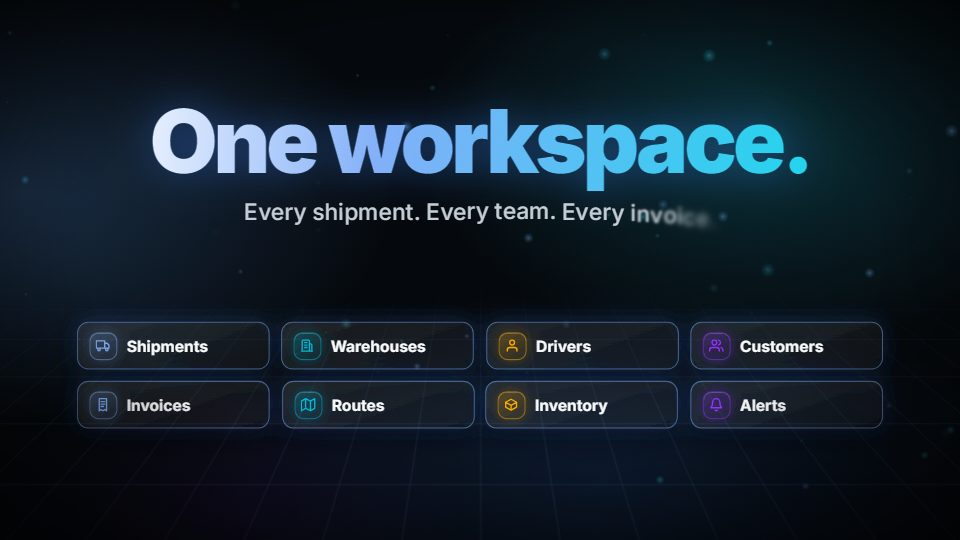
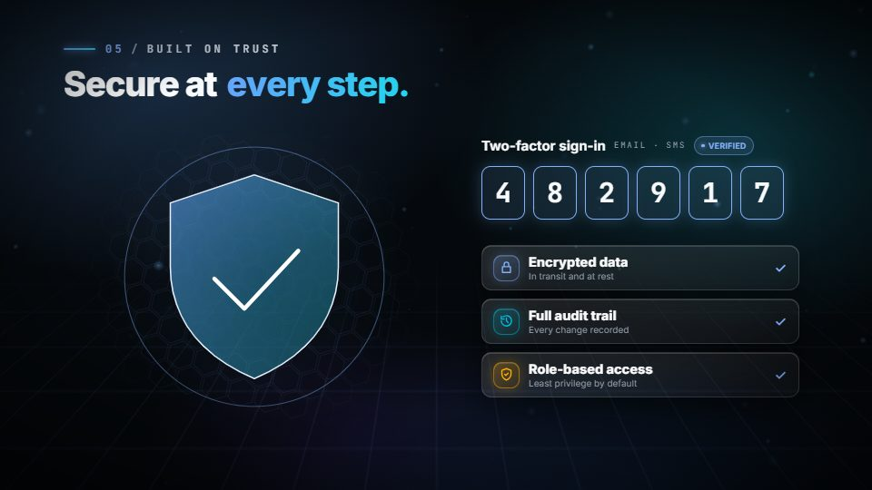
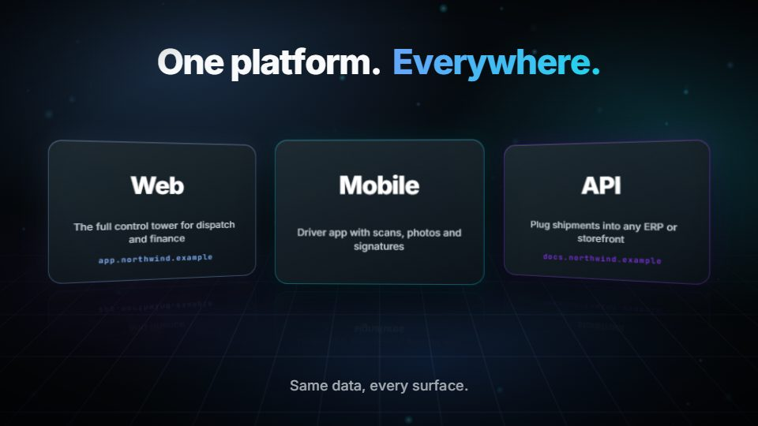
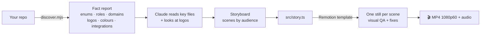

<div align="center">

# 🎬 repo-reel

### Turn any codebase into a cinematic product video.

*A Claude Agent Skill that reads your repo, finds the real story in it, and renders a 1080p60 motion-graphics MP4 with sound.*

[](https://skills.sh/vivekparmar-18/skillroom/repo-reel)
[](../../LICENSE)
[](https://github.com/vercel-labs/skills)
[](https://www.remotion.dev)

```bash
npx skills add VivekParmar-18/skillroom --skill repo-reel
```

</div>

| | | |
|---|---|---|
|  |  |  |
|  |  |  |
|  |  |  |

<sub>Frames from the bundled fictional examples in <code>examples/</code>. Real runs use your repo's name, logo, colours, statuses and roles.</sub>

---

## 😖 The problem

You built something real, but explaining it takes a demo call, a slide deck, or a designer and a week in After Effects. The best story about your product is already sitting in your codebase: the order lifecycle in a status enum, the user roles in a role table, the integrations in your dependencies. Nobody has turned it into something people can watch.

## ✨ The fix

**repo-reel** makes Claude your motion designer. Ask for a video and it:

1. **reads the repo** for facts: status and role enums, domains, integrations, security features, brand colours and logos;
2. **writes a storyboard** that fits the audience (clients, engineers, or both);
3. **builds the video** from a library of 10 cinematic, data-driven scenes;
4. **checks every scene** frame by frame and fixes clipping, overlaps and legibility;
5. **renders** a real **MP4, 1920×1080 at 60 fps**, with a synthesized soundtrack. There's no stock footage and nothing to license.

```
🎬 repo-reel — client cut · 60 s

Facts:       ShipmentStatus (5 stages) · 6 roles · Invoice OPEN→PARTIAL→PAID · 12 domains
Brand:       logo.png (4.2:1) · primary #3B82F6 · gradient #60A5FA → #22D3EE
Storyboard:  title → chaos → journey → flow → orbit → dashboard → trust → showcase → outro
QA:          9/9 scenes checked · 2 layout fixes
Output:      ../MyApp-Promo/out/promo.mp4   1920×1080 · 60 fps · 60.1 s · AAC audio ✓
```

---

## 🚀 Why it's different

| | Screen recording / slide deck | Hand-made motion design | 🎬 repo-reel |
|---|---|---|---|
| Time to first cut | hours | days to weeks | ✅ minutes |
| Story comes from | whoever presents | a brief | ✅ your actual code (enums, roles, flows) |
| Every claim traceable | ❌ | ❌ | ✅ fact sheet: claim → source file |
| Motion quality | none | high | ✅ springs, 3D, motion blur, particles, kinetic type |
| Sound | your mic | stock-music licence | ✅ synthesized, yours to keep |
| Edit & re-render | re-record | back to the designer | ✅ change one data file, re-render |

## 🎯 Features

- **Repo fact-finder:** `discover.mjs` (zero deps) works on any stack. It finds lifecycle and role enums in Java, Kotlin, TS, C# and Python; controller and route domains; integrations; logo candidates with pixel sizes; and your theme's real primary colour.
- **10 cinematic scenes:** logo ignition, chaos → order, lifecycle journey, money flow, role orbit, live dashboard, trust and security, tech stats, brand showcase, outro.
- **Studio-grade motion:** spring physics, per-character kinetic type, SVG path drawing, 3D perspective, depth of field, camera motion blur, light leaks, film grain, particle bursts and collapses, impact shakes.
- **Your brand:** the logo with a masked shine; a palette derived from one or two brand colours; multiple brands for white-label products; a gradient wordmark if there's no logo.
- **Synthesized sound:** whooshes, impacts, risers, UI pops and ticks, chimes, and an ambient pad sized to the video. Every cue is synced to the animation.
- **Honest by design:** only sourced claims, an "ILLUSTRATIVE DATA" tag on mock numbers, no compliance claims, and no secrets or internal URLs ever on screen.
- **One file to edit:** the whole video is `src/story.ts`. Tweak copy, then `npm run render`.

## 📦 Installation

**Via the skills.sh CLI (recommended):**

```bash
npx skills add VivekParmar-18/skillroom --skill repo-reel        # this skill only
npx skills add VivekParmar-18/skillroom --skill repo-reel -g     # user-wide (~/.claude/skills)
```

**Manually (Claude Code):**

```bash
git clone https://github.com/VivekParmar-18/skillroom.git
cp -r skillroom/skills/repo-reel ~/.claude/skills/
```

Restart Claude Code, then ask for a video (below).

**Requirements:** Node.js 18+ and about 400 MB of disk per promo project. Remotion downloads its own ffmpeg and headless Chrome on the first run, so you don't need a system ffmpeg. Works on Windows, macOS and Linux.

## 💡 Usage

From inside any repository, ask Claude Code:

- *"Make a 60 second promo video about this project"*
- *"Create a 30 second teaser trailer for this app, no sound"*
- *"Make a technical explainer video of this codebase for the engineering all-hands"*
- *"Turn this repo into a motion graphics video, and use the logo from ../web-client"*
- *"Make a 90 second sizzle reel that highlights the order lifecycle and the integrations"*

Claude asks about **audience**, **length** and **sound** if you didn't say. It then works in a new folder **next to** your repo (never inside it):

```
<YourRepo>-Promo/
├── facts.md        # discovery report + fact sheet (every claim → source file)
├── src/story.ts    # the storyboard as data: edit and re-render
└── out/promo.mp4   # 🎬
```

Watch it by double-clicking the MP4, or scrub it frame by frame with `npm run studio`.

## 🎞️ Scene library

| Scene | Length | What it shows | Fed by |
|---|---|---|---|
| `title` | 5 s | Light filament ignites, logo wipes in behind a scan edge, shine, tagline | brand name, tagline, logo |
| `chaos` | 6.3 s | Tangled, glitching chips snap into an ordered grid as the answer slams in | domains / actors the product unifies |
| `journey` | 10 s | A glowing path draws through 3–7 lifecycle stages; a comet rides the tip, nodes pop, cards rise | a status enum or state machine |
| `flow` | 8 s | A document flips in, cycles states to a stamp and confetti; value fans out on ribbons | invoices, payments, commissions, payouts |
| `orbit` | 8 s | Actors orbit the product hub in 3D with depth blur and pulses on the spokes | roles, tenants, services, integrations |
| `dashboard` | 8 s | A tilted 3D dashboard builds itself, live notifications stack in, an automation card scans | analytics, notifications, jobs, AI features |
| `trust` | 6 s | A shield assembles from shards, a 2FA code types itself, security features slide in | auth, 2FA, encryption, audit, RBAC |
| `stats` | 7 s | Big gradient counters in flipping tiles plus a tech-tag row | real repo numbers: endpoints, tests, integrations |
| `showcase` | 5.5 s | 1–3 cards fan out in 3D with floor reflections | brands, apps, editions |
| `outro` | 6.5 s | Particles collapse, flash, logo, tagline and URL, fade to black | tagline, public URL |

Recipes (**client 60 s · technical 60 s · teaser 30 s · long 90 s**) are in [`references/storyboard.md`](references/storyboard.md). Ready-made stories are in [`examples/`](examples/).

## ⚙️ How it works



A tight `SKILL.md` plus reference files and a ready-made Remotion project:

```
skills/repo-reel/
├── SKILL.md                  entry: workflow, QA loop, guardrails
├── references/
│   ├── storyboard.md         scene catalogue, copy-length limits, recipes, fact → scene mapping
│   └── craft.md              motion techniques, verified gotchas, adding a scene type
├── scripts/
│   ├── discover.mjs          repo fact-finder → Markdown report (zero deps)
│   ├── scaffold.mjs          copies template/ into a new promo folder
│   └── smoke-test.mjs        end-to-end self-test; regenerates README previews
├── examples/                 fictional stories: client-60s · technical-60s · teaser-30s
├── assets/previews/          the images above
└── template/                 Remotion 4 project (pinned)
    ├── scripts/gen-sfx.mjs   synthesizes all sound (pure Node)
    ├── scripts/timeline.mjs  scene start frames, total length, still picks
    └── src/
        ├── story.ts          ← the only file you normally edit
        ├── types.ts          documented schema for every scene
        ├── Video.tsx         timeline, transitions, audio cue sheet
        ├── theme.ts          palette derived from your brand colours, fonts
        ├── components/       kinetic type, particles, background, glass, 45 icons, brand
        └── scenes/           the 10 scene types
```

## 🎨 Customizing

Everything visible comes from `src/story.ts`:

```ts
export const STORY: Story = {
  brand: {
    name: "Northwind",
    tagline: "Operations software for modern logistics teams",
    url: "northwind.example",
    logo: "brand/logo.png", logoAspect: 4.2,          // optional: light-on-dark logo in public/brand/
    palette: { primary: "#3B82F6", gradient: ["#60A5FA", "#22D3EE"] },
  },
  scenes: [
    { type: "title" },
    { type: "journey", eyebrow: "The shipment lifecycle", title: ["From booking", "to doorstep."],
      stages: [ { title: "Booked", status: "SHIPMENT · BOOKED", icon: "clipboard" }, /* … */ ] },
    { type: "outro" },
  ],
};
```

- **Timing:** `node scripts/timeline.mjs` prints scene starts and total length. Add `dur: <frames>` to a scene (60 fps) and keep it at 80% of the default or more.
- **Colours:** `primary` plus two `gradient` stops. Tints, shades and accents are derived. `info`, `warn`, `violet` and `danger` are optional overrides.
- **Font:** swap `@remotion/google-fonts/Inter` in `src/theme.ts`.
- **Silent:** `musicVolume: 0`, and skip `gen-sfx`.
- **New scene types:** see [`references/craft.md`](references/craft.md#adding-a-new-scene-type).

## 🛡️ Guardrails

Written for videos you can show to customers:

- Only **true, sourced** claims. Every label traces to the repo.
- Made-up numbers appear only in `flow` and `dashboard` mock-ups, tagged **ILLUSTRATIVE DATA**. `stats` must be real counts.
- **No compliance claims** (HIPAA, SOC 2, GDPR "compliant") without evidence in the repo. It describes features instead.
- **No secrets, internal URLs, hostnames, tokens or customer data** on screen.
- Third-party names as plain text, never their logos.

## ❓ FAQ

<details>
<summary><b>Does it upload my code anywhere?</b></summary>
No. Discovery, rendering and sound synthesis all run locally. The only network use is <code>npm install</code> (Remotion and fonts) on the first run.
</details>

<details>
<summary><b>How long does a render take?</b></summary>
Roughly 3–8 minutes per minute of video on a modern laptop. Claude renders in the background and checks stills first, so failed renders are rare.
</details>

<details>
<summary><b>My repo has no logo or brand colours. Does it still work?</b></summary>
Yes. It falls back to a gradient wordmark and a monogram, and derives the palette from any primary colour it finds, or one you name.
</details>

<details>
<summary><b>Can I get vertical / social formats?</b></summary>
Not yet. Layouts are designed for 16:9 1080p. A 9:16 composition is on the roadmap.
</details>

<details>
<summary><b>Do I need a Remotion license?</b></summary>
Remotion is free for individuals, non-profits and companies with up to 3 employees. Larger companies need a <a href="https://www.remotion.dev/license">Remotion company license</a> to render. repo-reel itself is MIT.
</details>

## 🧰 Troubleshooting

| Symptom | Fix |
|---|---|
| Text wraps or clips in a card | Shorten the copy. Limits are in `references/storyboard.md`. |
| Logo invisible | It's dark ink on transparency. Use the colour or white variant, and look at the file: `white-logo.png` isn't always white. |
| Stills show old content | Re-run `npx remotion bundle` after every edit. Stills render from `build/`. |
| Render is slow | Lower `CameraMotionBlur` samples in `Chaos.tsx`, or use `--concurrency=50%`. |
| `EBUSY` / file locked (Windows) | Close Remotion Studio or the video player holding `out/`. |
| Blank frames in transitions | Avoid shader transitions (`zoomBlur`, `crossZoom`, `filmBurn`…). They need an experimental Chrome flag. |

## 🗺️ Roadmap

- [ ] 9:16 and 1:1 compositions for social
- [ ] Optional voice-over track from a script
- [ ] Beat-synced cuts to a user-supplied music file
- [ ] More scenes: architecture diagram, code-typing, before/after split screen
- [ ] Screenshot-in-device scene from a running app

## 🤝 Contributing

See [CONTRIBUTING.md](../../CONTRIBUTING.md). For this skill, run the self-test before opening a PR. It scaffolds, installs, typechecks, bundles and renders one still per scene:

```bash
node skills/repo-reel/scripts/smoke-test.mjs --example client-60s   # or technical-60s · teaser-30s
node skills/repo-reel/scripts/smoke-test.mjs --render               # full MP4 too
node skills/repo-reel/scripts/smoke-test.mjs --previews             # refresh the README images
```

Remotion packages are pinned to one exact version in `template/package.json`. Upgrade them together.

## 📄 License

[MIT](../../LICENSE) © Vivek Parmar. Built on [Remotion](https://www.remotion.dev), which has [its own license](https://www.remotion.dev/license). Fonts: Inter and JetBrains Mono (SIL OFL). All sounds are synthesized by `gen-sfx.mjs`.

<div align="center">

**If this made your product look good, give the repo a ⭐. It helps others find it on skills.sh.**

</div>
